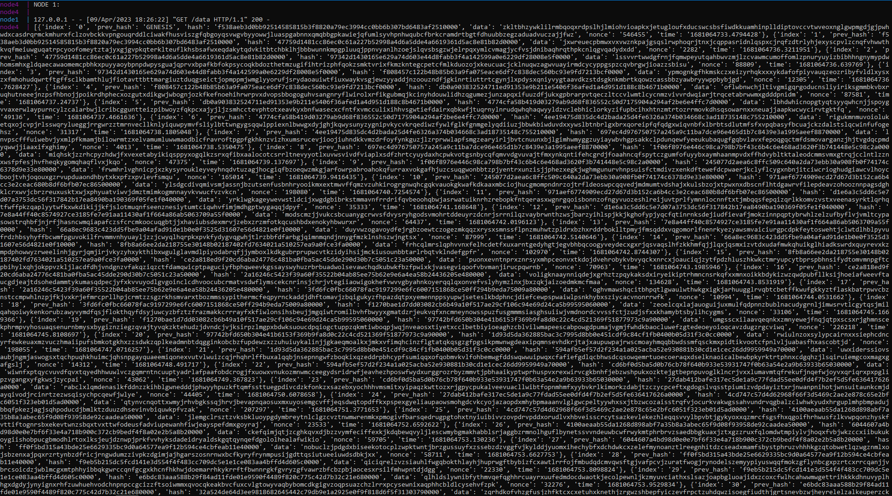

# Blockchain
Вы его не ждали, а он вышел.
## Описание
Данное задание было выполнено на языке Python с использованием фреймворка Flask. 

Используется два класса Block и Blockchain.

Класс Block содержит в себе поля: 
- index - индекс блока
- prev_hash - предыдущий хэш
- data - случайные данные
- nonce - дополнение, для выполнения требования для хэширования
- hash - текущий хэш
- time - время создания блока

Методы:
- concat - конкатенация полей
- hash_gen - генерация хэша

Класс Blockchain содержит поля:
- blocks - список блоков текущей цепочки
- address - порт текущей ноды
- addresses - список портов соседних нод

Также методы и функции: 
- new_block - создание нового блока
- add_block - добавление блока в список
- chain_clean - отчистка цепочки до блока с указанным индексом
- new_chain - замена всей цепочки на данную

Остальное взаимодействие между нодами описано в функциях-представлениях Flask. 
С их помощью реализовано разрешение ситуаций, когда ноды оказываются в minority.
Когда находится расхождение в хэшах и индексах блоков, нода или заменяет свои устаревшие блоки на актуальные
(сгенерированные раньше), либо запрашивает всю цепочку у случайной ноды, либо отправляет свою цепочку
той ноде, из которой пришёл неактуальный блок.

Также запуск работы нод происходит с сервера-эмулятора, который сначала отправляет первой ноде запрос
на генерацию блока GENESIS, далее, асинхронно, множество запросов на генерацию нового блока случайным 
нодам, после завершения отправки запросов сервер собирает цепочки с трех нод и выводит их.

## Запуск

Клонирование:
``` console
$ git clone https://github.com/hotnotHD/LegendaryBlockchain.git
```

Из папки проекта собрать образ:

``` console
$ docker build -t user/blockchain:latest .
```

Запустить Docker Compose

``` console
$ docker-compose up
```

## Демонстрация работы
Цепочка первой ноды


Цепочка второй ноды


Цепочка третьей ноды


Все ноды в результате работы содержат в себе единую цепочку.

## Тестирование

Тестирование проведено с помощью модульных тестов в папке tests.

Также добавлены автоматические тесты с помощью Github Actions:

[](https://github.com/hotnotHD/LegendaryBlockchain/actions/workflows/blockchain_tests.yml)
[](https://github.com/hotnotHD/LegendaryBlockchain/actions/workflows/blockchain_tests.yml)

